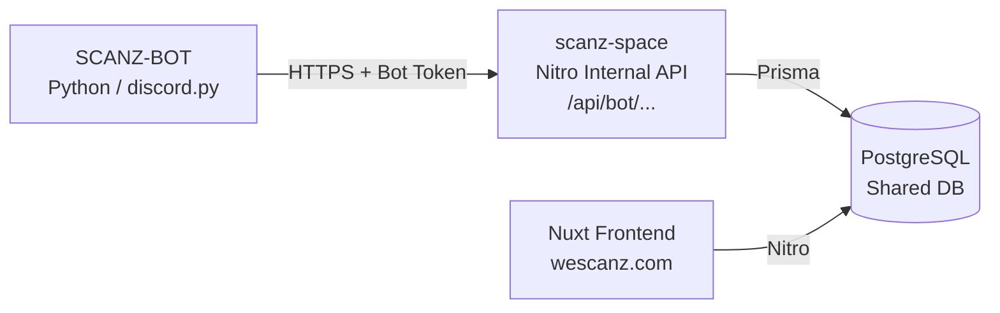
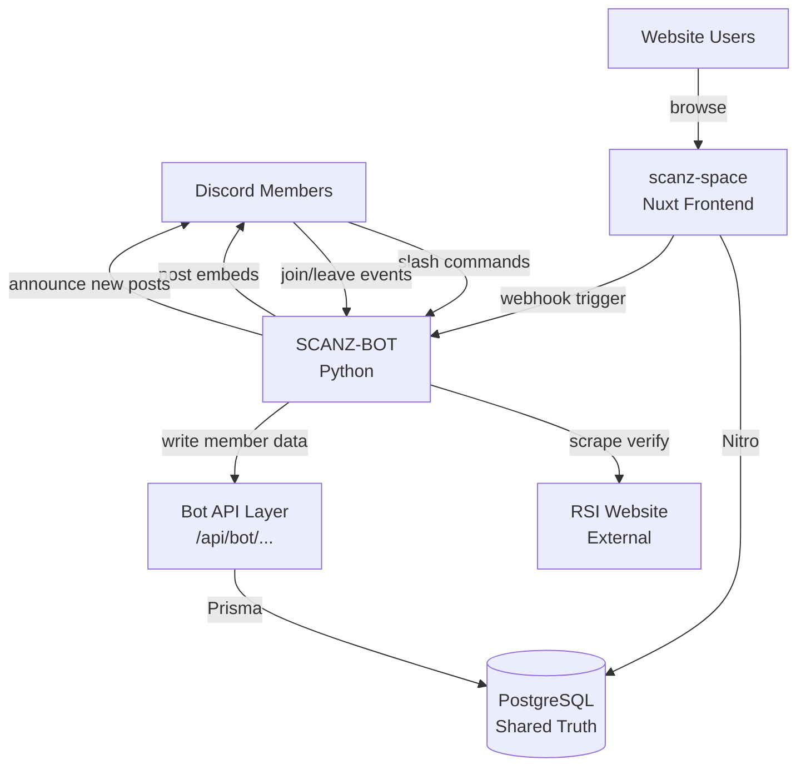

# SCANZ Integration Roadmap
## Discord Bot ↔ Website Unified Platform

> **Goal:** Evolve SCANZ-BOT and scanz-space from two independent systems into a single linked platform, with PostgreSQL as the shared source of truth, an internal REST API as the bridge, and a unified identity model connecting Discord, RSI, and website accounts.

---

## Scope Boundaries — What We Are NOT Building

SCANZ runs **MEE6** (Discord engagement, moderation, XP leveling) and **Statbot** (Discord activity analytics). We must not duplicate their capabilities.

| They Own | We Own |
|----------|--------|
| Message-count XP / server leaderboard (MEE6) | **Game-activity reputation** — points from trade runs, bounties, mining ops, event ops only |
| Discord moderation (warn/mute/ban) (MEE6) | **RSI org management** — verification, rank changes, roster drift alerts |
| Discord activity stats — messages, voice time, channel heatmaps (Statbot) | **RSI membership analytics** — org rank distribution, verification rates, roster growth |
| Server join/leave growth graphs (Statbot) | **Org roster audits** — who joined/left the RSI org, not the Discord server |
| Generic scheduled announcements (MEE6) | **Star Citizen game event scheduling** — ops, training, races, tied to RSI game sessions |

**The test:** if the data exists in Discord alone, it belongs to MEE6/Statbot. If it requires RSI scraping, game activity, or org context — it belongs to us.

---

## Current State Summary

| System | Stack | Data Store | What It Knows |
|--------|-------|-----------|----------------|
| SCANZ-BOT | Python / discord.py | SQLite (`enforcer.db`, `reaction_roles.db`, `suggestions.db`) | Discord IDs, RSI handles, org ranks, suggestions, enforcer config |
| scanz-space | Nuxt 3 / Prisma | PostgreSQL | Website users, posts, sessions, tags, gallery |

**The gap:** These two systems have **no shared identity** — a verified Discord member and a website user are completely unaware of each other.

---

## Integration Architecture

### Core Pattern: Internal Bot API

Rather than giving the bot direct PostgreSQL access, the website exposes a **private Bot API** (authenticated via a long-lived bot API token in `.env`). The bot calls this API to read/write shared data. This keeps:
- Schema ownership in the website's Prisma layer
- Validation and business logic in one place
- The bot decoupled from database internals



### Unified Identity Model

The foundational schema addition that unlocks everything else:

```
User (website account)
  ├── discordId        String? @unique   ← links to Discord user
  ├── rsiHandle        String? @unique   ← links to RSI profile
  ├── orgRank          OrgRank?          ← MAIN / AFFILIATE / GUEST
  ├── orgVerifiedAt    DateTime?
  └── avatarUrl        String?           ← RSI profile picture

DiscordLinkToken (for web-initiated Discord linking flow)
  ├── token            String @unique
  ├── userId           String
  └── expiresAt        DateTime
```

**Verification flows:**
- **Bot-initiated:** `/verify` command → bot writes `discordId + rsiHandle` to the website DB via Bot API → user's website profile is automatically enriched.
- **Web-initiated:** Website shows a "Link Discord" button → Discord OAuth2 → callback writes `discordId` to the website DB.

---

## Phase 1 — Identity Bridge (Foundation)

> Everything else depends on this. No new user-facing features, just plumbing.

### 1.1 Shared PostgreSQL for Bot Data

Migrate bot's persistent SQLite tables into PostgreSQL. The bot continues to call the **website's Nitro API** rather than writing directly. SQLite files remain as a local fallback cache during network outages.

**New Prisma models:**
- `VerifiedMember` — Discord ID, RSI handle, org rank, verification timestamp
- `ReactionRole` — guild ID, message ID, emoji, role ID
- `Suggestion` — author Discord ID, content, status, staff reply

**Bot changes:**
- Replace raw SQLite queries in [`cogs/verification.py`](../cogs/verification.py) and [`cogs/roster_monitor.py`](../cogs/roster_monitor.py) with `aiohttp` calls to the Bot API.
- Keep a local SQLite write-through cache for offline resilience.

### 1.2 Bot API Endpoints (website-side)

New private Nitro routes, all requiring `Authorization: Bearer <BOT_TOKEN>` header:

| Method | Path | Purpose |
|--------|------|---------|
| `POST` | `/api/bot/members/verify` | Write/update Discord ↔ RSI ↔ website link |
| `GET` | `/api/bot/members/:discordId` | Look up a member by Discord ID |
| `PATCH` | `/api/bot/members/:discordId/rank` | Update org rank after roster audit |
| `DELETE` | `/api/bot/members/:discordId` | Remove verification on kick/leave |
| `GET` | `/api/bot/members` | Paginated full roster (for sync) |

### 1.3 Website Profile Enrichment

Once `discordId` and `rsiHandle` are on `User`, the public profile at `/u/[username]` shows:
- RSI handle badge (links to RSI citizen page)
- Org rank badge (Main / Affiliate / Guest)
- Discord tag (optional, user-toggleable)
- RSI avatar pulled from profile scrape

---

## Phase 2 — Member Directory & Org Presence

### 2.1 Public Member Directory `/members`

A searchable, filterable roster page on the website showing all verified SCANZ members.

- Filter by org rank (Main / Affiliate / Guest)
- Link to each member's `/u/[username]` profile (if they have a website account)
- Shows RSI handle even for members who haven't created a website account yet
- Bot-driven: updated automatically after every roster audit

### 2.2 Org Stats Dashboard `/members/stats`

Visualised with simple charts (Chart.js or similar):
- Member count over time (growth curve)
- Rank distribution (Main vs Affiliate vs Guest)
- Verification rate (Discord members who have verified)
- Recent joins / recent departures

**Data source:** `VerifiedMember` table with `createdAt` timestamps, updated by the bot.

> **Not Statbot:** All metrics are sourced from RSI org membership data — rank, verification status, roster changes. We do not track Discord message counts, voice time, or channel activity; Statbot already owns that.

### 2.3 Discord → Website Account Claiming

A "Claim your profile" flow for verified Discord members who don't have a website account yet:
1. User runs `/claim-profile` on Discord → bot sends a time-limited magic link via DM.
2. Link opens `/register?token=XYZ` on the website.
3. Registration pre-fills RSI handle, skips verification — account is immediately linked.

---

## Phase 3 — Events System

### 3.1 Shared Event Model

New Prisma model:

```
Event
  ├── id               String @id
  ├── title            String
  ├── description      String?
  ├── startTime        DateTime
  ├── endTime          DateTime?
  ├── type             EventType   ← OPERATION / SOCIAL / TRAINING / RACE / OTHER
  ├── discordEventId   String?     ← Discord Scheduled Event ID
  ├── pingMessageId    String?     ← /ping embed message ID
  ├── createdByDiscordId String?
  ├── createdByUserId  String?     ← FK to User
  └── status          EventStatus  ← UPCOMING / ACTIVE / COMPLETED / CANCELLED
```

### 3.2 Bot → Website Event Push

When a staff member uses `/ping` to create an event embed:
- Bot writes event data to website DB via `POST /api/bot/events`
- Website calendar page `/events` shows the event immediately
- Bot also creates a Discord Scheduled Event via the Discord API

### 3.3 Website → Bot Event Announcement

When an admin creates an event on the website:
- Webhook fires to the bot's `webhook_listener.py`
- Bot posts a formatted embed to the configured events channel
- Bot creates the Discord Scheduled Event
- LFG "Remind Me" button is attached to the embed

### 3.4 Event Calendar Page `/events`

- Monthly/weekly calendar view of upcoming org events
- Each event links to a detail page with description, Discord event link, RSVP count
- iCal/ICS export for personal calendars

---

## Phase 4 — Game Features Database

### 4.1 Fleet Registry

Members register their ships via website profile or bot command.

**Prisma model:**
```
Ship
  ├── id             String @id
  ├── ownerId        String   ← FK to User
  ├── manufacturer   String
  ├── model          String
  ├── variant        String?
  ├── status         ShipStatus   ← FLIGHT_READY / CONCEPT / PLEDGE
  ├── role           ShipRole[]   ← COMBAT / MINING / HAULING / EXPLORATION / etc
  └── notes          String?
```

**Features:**
- `/fleet add <ship>` bot command → writes to DB → visible on website profile
- `/fleet org` bot command → queries org fleet aggregate from website API
- Website `/fleet` page showing org fleet breakdown by manufacturer, role, size class
- Integration with Erkul or Fleetyards for ship stats enrichment

### 4.2 Bounty Board

A cross-platform reputation ledger for PvP bounties, mining milestones, and org contributions.

**Prisma models:**
```
Bounty
  ├── id             String @id
  ├── title          String
  ├── description    String
  ├── reward         String?       ← UEC amount or item
  ├── status         BountyStatus  ← OPEN / CLAIMED / COMPLETED / EXPIRED
  ├── postedById     String        ← FK to User
  ├── claimedById    String?       ← FK to User
  └── evidenceUrl    String?       ← screenshot URL

ReputationEvent
  ├── id             String @id
  ├── userId         String        ← FK to User
  ├── points         Int
  ├── reason         String
  ├── source         RepSource     ← BOUNTY / MINING / EVENT / MANUAL
  └── createdAt      DateTime
```

> **Not MEE6 XP:** Points are awarded only for verifiable Star Citizen game actions — bounty completions, mining ops, trade run milestones, event participation. Message count and Discord activity are intentionally excluded; MEE6 already owns that space.

**Bot commands:**
- `/bounty list` — paginated list of open bounties from website API
- `/bounty claim <id>` — marks bounty as claimed
- `/bounty complete <id> screenshot:<attachment>` — submits evidence, awards points
- `/rep @member` — shows a member's reputation score

**Website pages:**
- `/bounty` — public board with open bounties, filterable by type/reward
- `/leaderboard` — org reputation rankings

### 4.3 Trade Ledger

Members log trade runs; aggregate data feeds an economy intelligence dashboard.

**Prisma model:**
```
TradeRun
  ├── id             String @id
  ├── userId         String        ← FK to User
  ├── commodity      String
  ├── buyLocation    String
  ├── sellLocation   String
  ├── quantitySCU    Int
  ├── profitAUEC     Int
  ├── shipModel      String?
  └── loggedAt       DateTime
```

**Bot commands:**
- `/trade log <commodity> <buy> <sell> <scu> <profit>` — logs a run
- `/trade stats` — personal stats from website API
- `/trade top` — org leaderboard (most profitable traders this week)

**Website `/trade` page:**
- Personal trade history
- Org aggregate: most traded commodities, top routes, total org revenue
- Commodity price tracker (pulling from sc-trade.tools or user-submitted data)

---

## Phase 5 — Social Integrations

### 5.1 Discord → Website Auto-Posting

Configure specific Discord channels to mirror content to website sections:
- `#scanz-updates` channel → automatically creates `OFFICIAL` posts on the website
- Bot watches for staff-pinned messages or specific role posts
- Configurable via `/autopost enable <channel> <section>` command

### 5.2 Website → Discord Notifications

When a website action occurs, the bot announces it in Discord:

| Website Event | Discord Action |
|--------------|---------------|
| New `OFFICIAL` post published | Embed in `#scanz-updates` |
| New `GUIDE` post published | Embed in `#guides` |
| New `CITIZEN` post published | Embed in `#citizen-logs` |
| New bounty posted | Embed in `#bounty-board` |
| Leaderboard update (weekly) | Embed in `#general` |

Bot polls `GET /api/bot/notifications/pending` every 5 minutes and posts queued embeds.

### 5.3 Web-Based Suggestions Portal

Extend the bot's suggestion system to the website:
- `/suggestions` page on website where members can submit and upvote ideas
- Bot command `/suggestion` remains for Discord-native submissions
- Staff can respond via website admin panel OR via Discord bot command
- Response triggers a DM to the submitter regardless of which channel staff used

### 5.4 Screenshot Gallery Bot Command

- `/screenshot <description> <attachment>` — bot uploads image to website gallery via `POST /api/bot/gallery`
- Image appears on `/gallery` with the member's website profile linked
- Tags can be added via bot command: `/screenshot tag <id> <tag>`

---

## Phase 6 — Admin & Moderation Unified

### 6.1 Web Admin Panel Extensions

- Unified member management: see Discord join date, RSI handle, org rank, website activity all in one view
- Ban/kick log mirrored from Discord to website admin log
- Verification override: admin can manually verify or unlink accounts from website UI

### 6.2 Cross-Platform Moderation Log

All moderation actions (bot kicks, manual verify, ban, suggestion rejection) written to a shared `ModerationLog` table:
```
ModerationLog
  ├── id             String @id
  ├── targetDiscordId String?
  ├── targetUserId   String?
  ├── action         ModAction
  ├── reason         String?
  ├── performedByDiscordId String?
  ├── performedByUserId    String?
  └── createdAt      DateTime
```

Website admin shows a unified audit trail; bot's current admin logging channel also continues.

---

## Technical Migration Path

### Bot Side Changes

1. Add `aiohttp` calls to the website's Bot API (already in `requirements.txt`)
2. Add `WEBSITE_API_URL` and `BOT_API_TOKEN` to `.env` / `.env.example`
3. Create `utils/api_client.py` — async wrapper for all Bot API calls with retry logic
4. Migrate cogs one-by-one: `verification.py` first, then `roster_monitor.py`, then others
5. Keep SQLite as a local read cache (not write-through) for bot-specific operational data

### Website Side Changes

1. Add unified identity fields to `User` in Prisma schema (`discordId`, `rsiHandle`, `orgRank`)
2. Add `packages/database/prisma/schema.prisma` models for new features per phase
3. Create `apps/web/server/api/bot/` route directory with bot-token middleware
4. Add `BOT_API_TOKEN` to website `.env`
5. New pages and components per feature phase

### Environment Variables to Add

**Bot `.env`:**
```
WEBSITE_API_URL=https://wescanz.com
BOT_API_TOKEN=<shared secret>
```

**Website `.env`:**
```
BOT_API_TOKEN=<shared secret>
DISCORD_CLIENT_ID=<for OAuth2>
DISCORD_CLIENT_SECRET=<for OAuth2>
```

---

## Feature Priority Matrix

| Feature | Impact | Complexity | Phase |
|---------|--------|-----------|-------|
| Identity Bridge (bot ↔ web account link) | 🔴 Critical | Medium | 1 |
| Bot API endpoints on website | 🔴 Critical | Medium | 1 |
| Profile enrichment (RSI handle, rank) | 🟠 High | Low | 1 |
| Member Directory | 🟠 High | Low | 2 |
| Account Claiming flow | 🟠 High | Medium | 2 |
| Events system | 🟠 High | High | 3 |
| Fleet Registry | 🟡 Medium | Medium | 4 |
| Bounty Board | 🟡 Medium | High | 4 |
| Trade Ledger | 🟡 Medium | Medium | 4 |
| Discord auto-posting | 🟡 Medium | Medium | 5 |
| Screenshot gallery command | 🟢 Nice | Low | 5 |
| Web Suggestions Portal | 🟢 Nice | Medium | 5 |
| Unified Moderation Log | 🟢 Nice | Medium | 6 |

---

## Mermaid: Full Integration Data Flow



---

## Next Steps

1. **Approve this roadmap** — confirm phase priorities and any features to drop/add.
2. **Phase 1 spike** — add `discordId` / `rsiHandle` to the Prisma `User` model and create the first Bot API route (`POST /api/bot/members/verify`) on the website.
3. **Bot API client** — create `utils/api_client.py` in SCANZ-BOT with an async HTTP client.
4. **Update `verification.py`** — wire the verification flow to write to the website DB instead of (or in addition to) SQLite.
5. **Profile UI** — surface RSI handle and org rank on `/u/[username]`.
